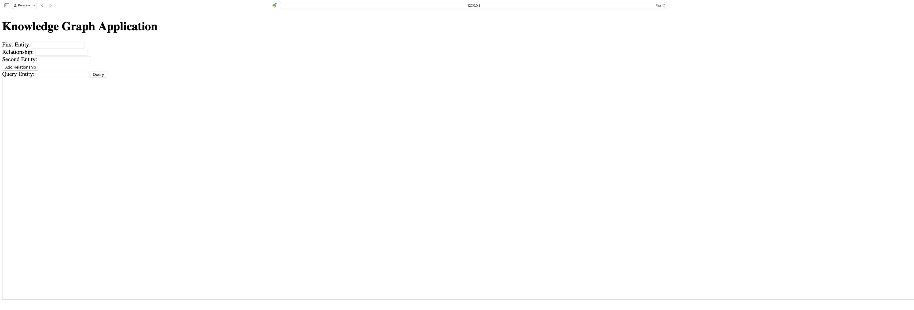
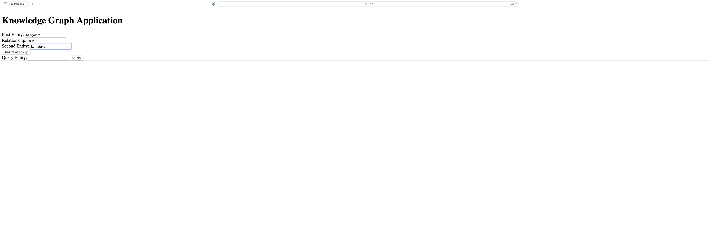
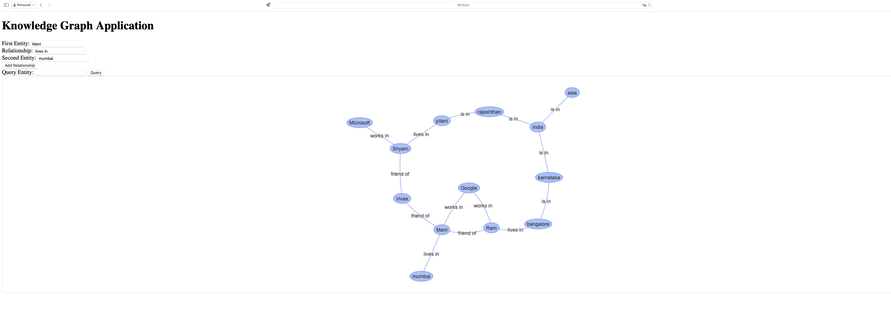
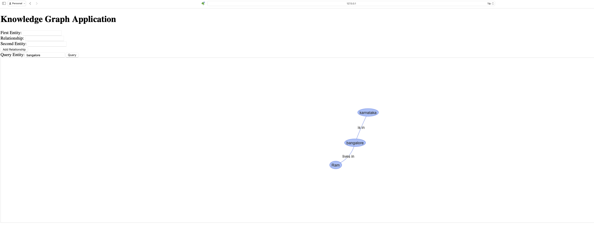
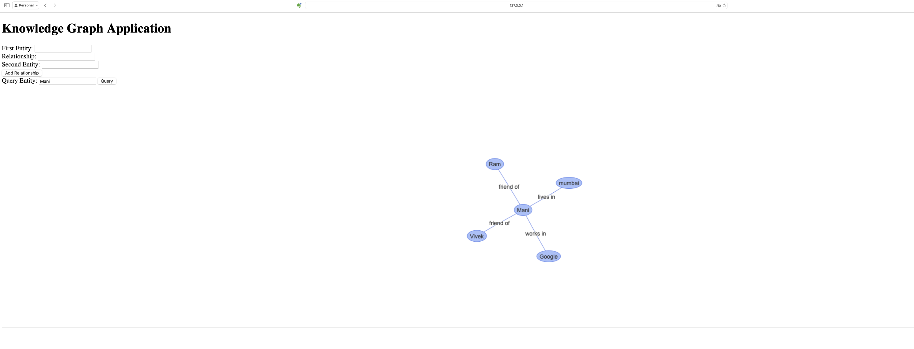
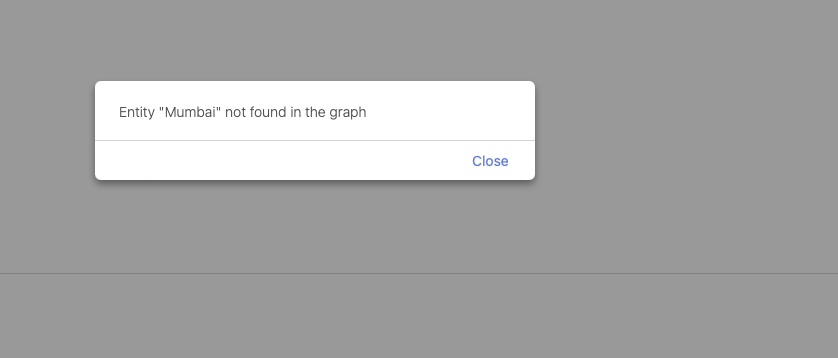

## Part A

### Instructions for Running the Application Locally

- Prerequisites:

    - Ensure you have `Python` installed (preferably version 3.6 or higher).
    - Ensure you have `Flask` and `NetworkX` installed. If not, install them using the following commands:
```shell
pip install flask
pip install networkx
```

- Download the Application:
  - Download or clone the repository containing the application code. (From `GitHub` as it has been collaborated on GitHub repo so that team members can collaborate)

- Navigate to the Application Directory

```shell
cd <local_path_to_application>
```

- Run the Flask Application:

```shell
python app.py
```

- Access the Web Interface:
  - Open your web browser and navigate to `http://localhost:5000`


### Brief Report


> Design Choices


- Technology Stack:

    - **Backend**: Flask was chosen for its simplicity and ease of use for creating web applications. NetworkX was used to manage and manipulate the knowledge graph.
    - **Frontend**: HTML and JavaScript were used to create a user-friendly interface. Vis.js library was used for graph visualization due to its powerful and flexible visualization capabilities.

- Modular Code Structure:

    - The application was designed to be modular, separating the frontend and backend logic. This separation ensures maintainability and ease of debugging.

- Dynamic Updates:
    - The frontend dynamically updates the graph visualization as new relationships are added. This was achieved by using the vis.js library and ensuring that nodes and edges are managed efficiently.

- Error Handling:
  - Comprehensive error handling was implemented both on the backend and frontend to provide meaningful feedback to users. For instance, alerts were added to notify users of any errors during relationship addition or querying.


> Challenges Faced

- Dynamic Graph Updates:

    - Ensuring that the graph visualization dynamically updates without duplicating nodes or edges was challenging. This required careful management of the DataSets for nodes and edges in vis.js.

- Handling Complex Relationships:

  - Adding and visualizing multiple types of relationships required thoughtful design to ensure that the application remains intuitive and the visualization clear. Ensuring that the relationships between different types of entities (e.g., geographical, professional, social) were correctly represented was particularly challenging.

- Error Feedback:

    - Providing meaningful error feedback to users involved implementing robust error handling both on the backend (e.g., checking for missing or non-existent entities) and the frontend (e.g., displaying alerts for errors).


### Screenshots


- Home Page:
  - Description: The initial view when the application is accessed.


<br/>

- Adding a Relationship:
  - Description: Adding a relationship between entities using the input fields.


<br/>

- Graph Visualization:
  - Description: Visualization of the knowledge graph after adding relationships


<br/>

- Querying an Entity
  - Description: Querying an entity to see its relationships


<br/>



<br/>

- Error Handling
  - Description: Alert displayed when an error occurs, such as query a non-existent entity.


<br/>


### Conclusion
The `Knowledge Graph` application successfully demonstrates the integration of a web-based frontend with a Flask backend to manage and visualize complex relationships between entities. The design choices focused on simplicity, modularity, and user-friendliness, while addressing challenges related to dynamic updates, complex relationship management, and robust error handling. This application serves as a foundational example that can be further extended to support more advanced features and larger datasets.